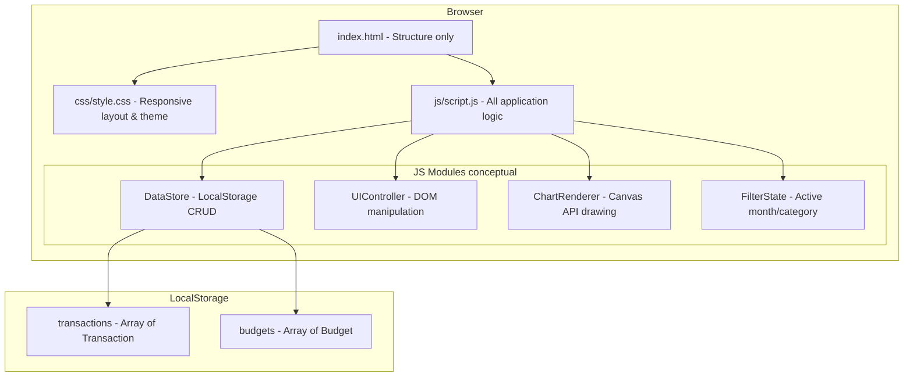
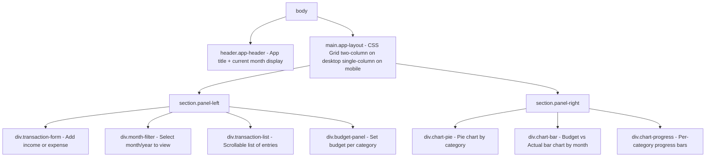
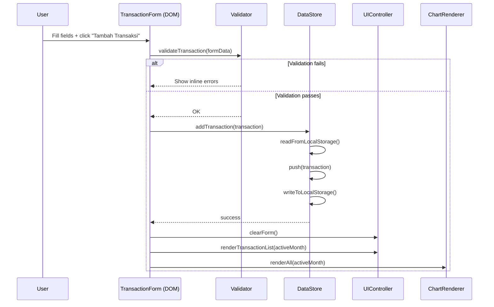
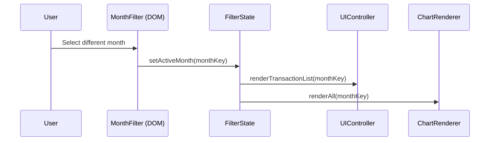
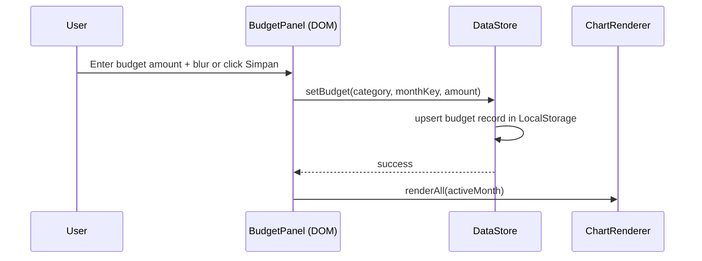
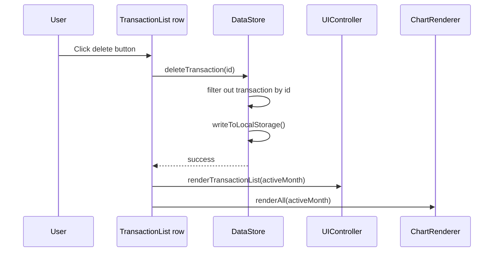

# Design Document: Expense & Budget Visualizer

## Overview

A client-side single-page web application that lets users track personal finances — income, expenses, and category budgets — with real-time visualizations rendered directly on HTML5 Canvas using no third-party chart libraries. All data is persisted in the browser's LocalStorage API; there is no backend dependency. The UI is structured as a single `index.html` file, styled by `css/style.css`, and driven by `js/script.js`.

The app gives users three views in one screen: a transaction log with filtering, an interactive budget-setting panel, and a dashboard of live charts (pie chart by category, bar chart of budget vs actual per month, and per-category progress bars).

---

## Architecture



The application has no build step, no module bundler, and no framework. All four conceptual modules are plain JavaScript objects/functions in `js/script.js`, organized via an IIFE or top-level module pattern. Communication between modules is direct function calls; there is no event bus or reactive system.

---

## Component Architecture (UI Sections)



### Panel Descriptions

**header.app-header**
- App name/logo
- Displays currently selected month label (e.g., "Juli 2025")

**div.transaction-form**
- Inputs: description (text), amount (number), type (income/expense radio or select), category (select), date (date picker)
- Submit button: "Tambah Transaksi"
- Validation feedback inline

**div.month-filter**
- `<select>` populated dynamically with all months that have at least one transaction, plus current month
- Changing selection triggers chart and list re-render

**div.transaction-list**
- Filtered by selected month
- Each row: date, description, category badge, amount (colored green for income, red for expense)
- Delete button per row (icon button)

**div.budget-panel**
- One row per expense category
- Input field showing current budget amount (editable)
- "Simpan" button per row (or auto-save on blur)

**div.chart-pie**
- `<canvas id="pieChart">` — expenses grouped by category for selected month
- Legend below canvas (category name + percentage)

**div.chart-bar**
- `<canvas id="barChart">` — for each of the last 6 months: grouped bars (budget total vs actual spend)

**div.chart-progress**
- For each expense category: label, progress bar canvas or CSS bar, amount used / budget

---

## Data Models

All data lives in LocalStorage under two keys.

### `transactions` — `localStorage.getItem('ebv_transactions')`

Stored as a JSON-serialized array of `Transaction` objects.

```pascal
STRUCTURE Transaction
  id         : String   -- UUID v4, e.g. "a3f2..."
  type       : String   -- "income" | "expense"
  category   : String   -- must be one of CATEGORIES list for expenses;
                        --   "income" for income entries
  description: String   -- free text, max 100 chars
  amount     : Number   -- positive float, in local currency units
  date       : String   -- ISO 8601 date "YYYY-MM-DD"
  createdAt  : Number   -- Date.now() timestamp for sort stability
END STRUCTURE
```

### `budgets` — `localStorage.getItem('ebv_budgets')`

Stored as a JSON-serialized array of `Budget` objects.

```pascal
STRUCTURE Budget
  category   : String   -- must be one of CATEGORIES list
  monthKey   : String   -- "YYYY-MM" e.g. "2025-07"
  amount     : Number   -- positive float; 0 means no budget set
END STRUCTURE
```

### `CATEGORIES` — hardcoded constant list

```pascal
CONSTANT CATEGORIES = [
  "Makanan & Minuman",
  "Transportasi",
  "Belanja",
  "Hiburan",
  "Kesehatan",
  "Pendidikan",
  "Tagihan & Utilitas",
  "Lainnya"
]
```

### LocalStorage Keys

```pascal
CONSTANT LS_TRANSACTIONS = "ebv_transactions"
CONSTANT LS_BUDGETS      = "ebv_budgets"
```

### Derived Aggregates (computed at render time, never stored)

```pascal
STRUCTURE MonthSummary
  monthKey      : String          -- "YYYY-MM"
  totalIncome   : Number
  totalExpense  : Number
  byCategory    : Map<String, Number>  -- category -> total expense amount
END STRUCTURE

STRUCTURE BudgetComparison
  category      : String
  budgeted      : Number          -- 0 if no budget set
  actual        : Number
  percentage    : Number          -- actual / budgeted * 100; Infinity if budgeted = 0
END STRUCTURE
```

---

## Sequence Diagrams

### Add Transaction Flow



### Change Month Filter Flow



### Set Budget Flow



### Delete Transaction Flow



---

## Chart Rendering Approach (Canvas API)

All charts are drawn imperatively on `<canvas>` elements. No external library is used. Each render call clears the canvas and redraws from scratch.

### Pie Chart — Expenses by Category

```pascal
PROCEDURE renderPieChart(canvas, monthSummary)
  INPUT: canvas HTMLCanvasElement, monthSummary MonthSummary
  OUTPUT: void (draws on canvas)

  ctx ← canvas.getContext("2d")
  ctx.clearRect(0, 0, canvas.width, canvas.height)

  totalExpense ← SUM of monthSummary.byCategory.values()

  IF totalExpense = 0 THEN
    drawEmptyState(ctx, canvas, "Tidak ada pengeluaran bulan ini")
    RETURN
  END IF

  cx     ← canvas.width / 2
  cy     ← canvas.height / 2
  radius ← MIN(cx, cy) * 0.85
  startAngle ← -π/2   -- start at 12 o'clock

  FOR EACH (category, amount) IN monthSummary.byCategory DO
    sliceAngle ← (amount / totalExpense) * 2π
    color      ← CATEGORY_COLORS[category]

    ctx.beginPath()
    ctx.moveTo(cx, cy)
    ctx.arc(cx, cy, radius, startAngle, startAngle + sliceAngle)
    ctx.closePath()
    ctx.fillStyle ← color
    ctx.fill()
    ctx.strokeStyle ← "#fff"
    ctx.lineWidth ← 2
    ctx.stroke()

    startAngle ← startAngle + sliceAngle
  END FOR

  drawPieLegend(ctx, canvas, monthSummary, totalExpense)
END PROCEDURE
```

### Bar Chart — Budget vs Actual (Last 6 Months)

```pascal
PROCEDURE renderBarChart(canvas, store, activeMonthKey)
  INPUT: canvas, store DataStore, activeMonthKey String
  OUTPUT: void

  ctx ← canvas.getContext("2d")
  ctx.clearRect(0, 0, canvas.width, canvas.height)

  months ← getLast6Months(activeMonthKey)   -- ["YYYY-MM", ...]
  padding ← { top: 30, right: 20, bottom: 50, left: 60 }

  chartWidth  ← canvas.width  - padding.left - padding.right
  chartHeight ← canvas.height - padding.top  - padding.bottom

  groupWidth  ← chartWidth / months.length
  barWidth    ← groupWidth * 0.35
  gap         ← groupWidth * 0.05

  allValues ← FLATTEN [totalBudget(m), totalActual(m) FOR m IN months]
  maxValue  ← MAX(allValues) * 1.1   -- 10% headroom
  IF maxValue = 0 THEN maxValue ← 1 END IF

  drawYAxis(ctx, padding, chartHeight, maxValue)
  drawXAxisLabels(ctx, padding, chartWidth, chartHeight, months)

  FOR i ← 0 TO months.length - 1 DO
    m        ← months[i]
    budgeted ← totalBudget(store, m)
    actual   ← totalActual(store, m)
    x        ← padding.left + i * groupWidth + gap

    -- Budget bar (blue)
    barH_budget ← (budgeted / maxValue) * chartHeight
    ctx.fillStyle ← COLOR_BUDGET
    ctx.fillRect(x, padding.top + chartHeight - barH_budget, barWidth, barH_budget)

    -- Actual bar (orange/red if over budget, green if under)
    barH_actual ← (actual / maxValue) * chartHeight
    ctx.fillStyle ← IF actual > budgeted THEN COLOR_OVER ELSE COLOR_UNDER
    ctx.fillRect(x + barWidth + gap, padding.top + chartHeight - barH_actual, barWidth, barH_actual)
  END FOR

  drawBarLegend(ctx, canvas, padding)
END PROCEDURE
```

### Progress Bars — Per Category

Progress bars are rendered as DOM elements (HTML `<div>` with CSS width%) rather than on a separate canvas, because they integrate better with scrollable lists and screen readers.

```pascal
PROCEDURE renderProgressBars(container, comparisons)
  INPUT: container HTMLElement, comparisons Array<BudgetComparison>
  OUTPUT: void (updates DOM)

  container.innerHTML ← ""

  FOR EACH comp IN comparisons DO
    pct     ← MIN(comp.percentage, 100)
    color   ← IF comp.percentage > 100 THEN "#ef4444"
               ELSE IF comp.percentage > 80 THEN "#f59e0b"
               ELSE "#22c55e"

    html ← buildProgressBarHTML(comp.category, comp.actual, comp.budgeted, pct, color)
    container.insertAdjacentHTML("beforeend", html)
  END FOR
END PROCEDURE
```

### Canvas Sizing & HiDPI

```pascal
PROCEDURE resizeCanvas(canvas)
  INPUT: canvas HTMLCanvasElement
  OUTPUT: void

  dpr ← window.devicePixelRatio OR 1
  rect ← canvas.getBoundingClientRect()

  canvas.width  ← rect.width  * dpr
  canvas.height ← rect.height * dpr

  ctx ← canvas.getContext("2d")
  ctx.scale(dpr, dpr)

  -- CSS size stays the same; only the backing buffer is scaled
END PROCEDURE
```

---

## Key Functions with Formal Specifications

### `addTransaction(transaction)`

```pascal
FUNCTION addTransaction(transaction Transaction) → Boolean
```

**Preconditions:**
- `transaction.id` is a non-empty unique string
- `transaction.type` ∈ {"income", "expense"}
- `transaction.amount` > 0
- `transaction.date` matches `YYYY-MM-DD` pattern
- `transaction.category` ∈ CATEGORIES ∪ {"income"}
- `transaction.description` is a non-empty string, length ≤ 100

**Postconditions:**
- Returns `true` on success
- `readTransactions()` result contains the new transaction
- LocalStorage key `ebv_transactions` is updated
- No other transaction is modified

**Loop Invariants:** N/A

---

### `deleteTransaction(id)`

```pascal
FUNCTION deleteTransaction(id String) → Boolean
```

**Preconditions:**
- `id` is a non-empty string

**Postconditions:**
- If a transaction with `id` existed: it is no longer present in `readTransactions()`
- If no transaction with `id` existed: list is unchanged
- Returns `true` in both cases
- LocalStorage is updated

---

### `setBudget(category, monthKey, amount)`

```pascal
FUNCTION setBudget(category String, monthKey String, amount Number) → Boolean
```

**Preconditions:**
- `category` ∈ CATEGORIES
- `monthKey` matches `YYYY-MM` pattern
- `amount` ≥ 0

**Postconditions:**
- Exactly one Budget record with matching `(category, monthKey)` exists after the call
- Its `amount` equals the provided `amount`
- Returns `true` on success

---

### `getSummaryForMonth(monthKey)`

```pascal
FUNCTION getSummaryForMonth(monthKey String) → MonthSummary
```

**Preconditions:**
- `monthKey` matches `YYYY-MM`

**Postconditions:**
- Returns a valid `MonthSummary`
- `summary.totalIncome` = SUM of all income transactions in that month
- `summary.totalExpense` = SUM of all expense transactions in that month
- `summary.byCategory[c]` = SUM of expense amounts for category `c` in that month
- Categories with zero expenses may be omitted from `byCategory`

---

### `validateTransaction(formData)`

```pascal
FUNCTION validateTransaction(formData Object) → ValidationResult
```

**Preconditions:**
- `formData` is a plain object with fields matching the form

**Postconditions:**
- Returns `{ valid: true }` if and only if all field constraints pass
- Returns `{ valid: false, errors: Map<fieldName, errorMessage> }` otherwise
- No side effects on LocalStorage or DOM

**Loop Invariants:**
- For each field checked: previously validated fields remain valid

---

## Algorithmic Pseudocode

### Main Initialization

```pascal
ALGORITHM initApp()
INPUT: none
OUTPUT: void

BEGIN
  transactions ← DataStore.readTransactions()
  budgets      ← DataStore.readBudgets()
  activeMonth  ← getCurrentMonthKey()   -- "YYYY-MM"

  UIController.populateMonthFilter(transactions)
  UIController.populateCategorySelect()
  UIController.populateBudgetPanel(budgets, activeMonth)
  UIController.renderTransactionList(transactions, activeMonth)

  ChartRenderer.resizeAllCanvases()
  ChartRenderer.renderAll(transactions, budgets, activeMonth)

  UIController.bindEventListeners()
END
```

### Monthly Aggregation Algorithm

```pascal
ALGORITHM aggregateMonth(transactions, monthKey)
INPUT: transactions Array<Transaction>, monthKey String "YYYY-MM"
OUTPUT: summary MonthSummary

BEGIN
  summary.monthKey    ← monthKey
  summary.totalIncome ← 0
  summary.totalExpense ← 0
  summary.byCategory  ← {}

  FOR EACH tx IN transactions DO
    ASSERT tx has valid date field

    IF getMonthKey(tx.date) ≠ monthKey THEN
      CONTINUE
    END IF

    IF tx.type = "income" THEN
      summary.totalIncome ← summary.totalIncome + tx.amount
    ELSE  -- expense
      summary.totalExpense ← summary.totalExpense + tx.amount
      prev ← summary.byCategory[tx.category] OR 0
      summary.byCategory[tx.category] ← prev + tx.amount
    END IF
  END FOR

  RETURN summary
END
```

**Loop Invariant:** At each iteration, `summary.totalIncome` and `summary.totalExpense` correctly reflect all processed transactions belonging to `monthKey`.

### Budget Comparison Algorithm

```pascal
ALGORITHM buildBudgetComparisons(budgets, summary, monthKey)
INPUT: budgets Array<Budget>, summary MonthSummary, monthKey String
OUTPUT: comparisons Array<BudgetComparison>

BEGIN
  comparisons ← []

  FOR EACH category IN CATEGORIES DO
    budgetRecord ← FIND budget IN budgets
                      WHERE budget.category = category
                        AND budget.monthKey = monthKey

    budgeted ← IF budgetRecord EXISTS THEN budgetRecord.amount ELSE 0
    actual   ← summary.byCategory[category] OR 0
    pct      ← IF budgeted > 0 THEN (actual / budgeted) * 100 ELSE 0

    comparisons.PUSH({
      category:   category,
      budgeted:   budgeted,
      actual:     actual,
      percentage: pct
    })
  END FOR

  RETURN comparisons
END
```

### UUID Generation (no crypto dependency)

```pascal
ALGORITHM generateUUID()
INPUT: none
OUTPUT: uuid String (format "xxxxxxxx-xxxx-4xxx-yxxx-xxxxxxxxxxxx")

BEGIN
  RETURN replace pattern with random hex digits
  -- Uses Math.random() for each hex nibble
  -- 'y' nibble masked with 0x3 OR 0x8 (RFC 4122 variant)
END
```

---

## Responsive Layout Strategy

### Breakpoints

```pascal
CONSTANT BREAKPOINT_DESKTOP = 768   -- px
```

### CSS Grid Layout

```css
/* Mobile first: single column */
.app-layout {
  display: grid;
  grid-template-columns: 1fr;
  gap: 1rem;
  padding: 1rem;
}

/* Desktop: two columns, right panel wider */
@media (min-width: 768px) {
  .app-layout {
    grid-template-columns: 360px 1fr;
    gap: 1.5rem;
    padding: 1.5rem;
  }
}
```

### Canvas Responsiveness

Canvas elements are sized via CSS (`width: 100%`, fixed `height`) and the JS `resizeCanvas()` function is called:
- On `DOMContentLoaded`
- On `window.resize` (debounced 150 ms)

This ensures charts fill available space without blurring on HiDPI screens.

---

## Error Handling

### Scenario 1: LocalStorage Unavailable or Quota Exceeded

**Condition:** `localStorage.setItem()` throws a `DOMException`
**Response:** Catch exception; display a non-blocking toast notification "Data tidak dapat disimpan — penyimpanan penuh atau diblokir."
**Recovery:** App continues to work in-memory for the session; data is lost on refresh.

### Scenario 2: Corrupt LocalStorage Data

**Condition:** `JSON.parse()` throws on stored data
**Response:** Log error to console; treat as empty data set (both `transactions` and `budgets` default to `[]`)
**Recovery:** User can start fresh; corrupt key is overwritten on next successful save.

### Scenario 3: Form Validation Failure

**Condition:** User submits transaction form with missing or invalid fields
**Response:** Inline error messages below each invalid field; form is not submitted
**Recovery:** User corrects inputs and resubmits.

### Scenario 4: Zero Budget (Division by Zero in Progress Bar)

**Condition:** `budgeted === 0` when computing `percentage`
**Response:** Progress bar shows 0%; label shows "Belum diatur"
**Recovery:** User sets a budget via the Budget Panel.

### Scenario 5: No Transactions for Selected Month

**Condition:** Filtered transaction list is empty
**Response:** Transaction list shows "Tidak ada transaksi bulan ini"; pie chart shows empty-state message; progress bars still render (with 0 actual)
**Recovery:** User adds transactions or selects a different month.

---

## Testing Strategy

### Unit Testing Approach

Key pure functions to unit test with example inputs:
- `aggregateMonth(transactions, monthKey)` — verify totals and byCategory sums
- `buildBudgetComparisons(budgets, summary, monthKey)` — verify percentage calculation
- `validateTransaction(formData)` — verify all field validation rules
- `getMonthKey(isoDateString)` — verify date parsing
- `getLast6Months(activeMonthKey)` — verify correct 6-month window

### Property-Based Testing Approach

**Property Test Library**: fast-check (JavaScript)

Properties:
- Round-trip: serialize then deserialize transactions yields equivalent array
- Budget percentage invariant: `percentage = 0` when `budgeted = 0`
- Aggregation invariant: `totalExpense = SUM(byCategory.values())`
- Month filter invariant: all transactions in `renderList(monthKey)` have matching month in date
- Delete invariant: after `deleteTransaction(id)`, no transaction with that `id` exists

### Integration Testing Approach

Manual smoke tests (no automated integration framework for a localStorage app):
- Full add → list → delete cycle
- Budget set → progress bar update
- Month filter switch → chart re-render
- Page reload → data persists from LocalStorage

---

## Performance Considerations

- Canvas redraws are triggered only on data mutations or resize events — not on every frame
- `window.resize` handler is debounced (150 ms) to avoid excessive canvas redraws
- Transaction list is rendered as a single `innerHTML` string built via array join, avoiding repeated DOM insertions
- LocalStorage reads are batched at app init; subsequent operations read from in-memory cache and write-through to storage

---

## Security Considerations

- All user input rendered to DOM is escaped (use `textContent` not `innerHTML` for user-provided strings)
- Amount input is parsed as `parseFloat` and validated as a finite positive number before storage
- Category is validated against the whitelist `CATEGORIES` array; arbitrary strings are rejected
- No external scripts, fonts, or CDN resources — fully offline-capable

---

## Dependencies

**None.** The application uses only:
- HTML5 Canvas API (browser built-in)
- Web Storage API — `localStorage` (browser built-in)
- `Math.random()` for UUID generation
- Standard DOM APIs (`document.querySelector`, `addEventListener`, etc.)
- CSS Grid and Flexbox (browser built-in)

---

## Correctness Properties

*A property is a characteristic or behavior that should hold true across all valid executions of a system — essentially, a formal statement about what the system should do. Properties serve as the bridge between human-readable specifications and machine-verifiable correctness guarantees.*

### Property 1: Aggregation consistency

*For any* array of expense transactions belonging to a given month, the `totalExpense` in the computed `MonthSummary` must equal the sum of all individual `byCategory` values.

**Validates: Requirements 11.3, 11.5**

### Property 2: Transaction round-trip persistence

*For any* valid `Transaction` object, adding it to the store and then reading all transactions must yield an array that contains a structurally equivalent object.

**Validates: Requirements 2.1, 3.1, 3.4**

### Property 3: Month filter exclusivity

*For any* month key and list of transactions, every transaction returned by `getTransactionsForMonth(monthKey)` must have a date whose `YYYY-MM` prefix equals `monthKey`.

**Validates: Requirements 4.3**

### Property 4: Budget upsert idempotence

*For any* `(category, monthKey, amount)` triple, calling `setBudget` twice with the same arguments must produce the same stored state as calling it once — exactly one budget record for that `(category, monthKey)` pair.

**Validates: Requirements 5.2**

### Property 5: Delete completeness

*For any* transaction ID that exists in the store, calling `deleteTransaction(id)` must result in no transaction with that ID being present in the subsequent `readTransactions()` result.

**Validates: Requirements 2.9**

### Property 6: Validation rejection of invalid inputs

*For any* string composed entirely of whitespace characters, `validateTransaction` must return `valid: false` on the `description` field. *For any* amount value ≤ 0 (including zero, negative numbers, and NaN), `validateTransaction` must return `valid: false` on the `amount` field. *For any* category string not in the CATEGORIES constant, `validateTransaction` must return `valid: false` on the `category` field for expense transactions.

**Validates: Requirements 2.2, 2.3, 2.5, 2.7**

### Property 7: Budget percentage invariant

*For any* `BudgetComparison` where `budgeted = 0`, the `percentage` field must be `0` (no division-by-zero). *For any* `BudgetComparison` where `actual > budgeted`, the progress bar fill must be capped at 100% visually even though the raw percentage exceeds 100.

**Validates: Requirements 5.5, 8.2, 8.7**

### Property 8: Serialization round-trip

*For any* array of valid `Transaction` or `Budget` objects, serializing to JSON and parsing back must produce an array with structurally equivalent objects — ensuring data survives the LocalStorage serialize/deserialize cycle.

**Validates: Requirements 3.1, 3.2**

### Property 9: Unique transaction identifiers

*For any* N transactions added to the store, all N generated IDs must be distinct — no two transactions may share the same ID.

**Validates: Requirements 2.10**

### Property 10: Six-month window correctness

*For any* active month key, `getLast6Months(monthKey)` must return an array of exactly 6 MonthKey strings in chronological ascending order, ending with the given `monthKey`.

**Validates: Requirements 7.2**

### Property 11: Progress bar color thresholds

*For any* `BudgetComparison` where `percentage ≥ 100`, the rendered color must be the warning color (red). *For any* comparison where `80 ≤ percentage < 100`, the color must be caution (amber). *For any* comparison where `percentage < 80`, the color must be safe (green).

**Validates: Requirements 8.3, 8.4, 8.5**
